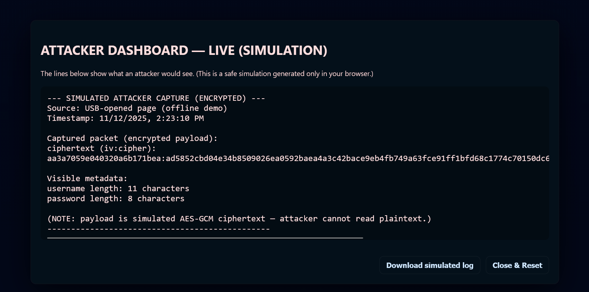
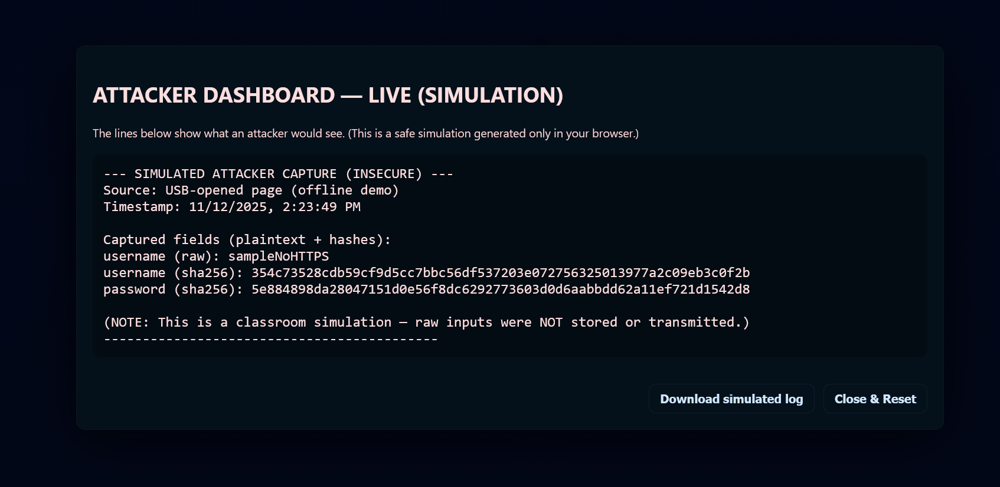
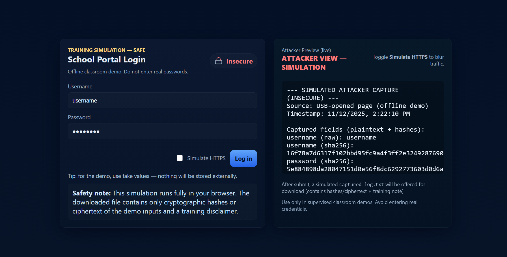

# School Login — Phishing Demo

Offline, single-file classroom demo that simulates a school login page and shows how credentials can be captured by an attacker (live preview). Includes a "Simulate HTTPS" toggle to contrast plaintext leaks vs encrypted payloads.

**Purpose:** security awareness training for teachers and students. **DO NOT** enter real credentials.

## Usage
- Open `index.html` locally or use GitHub Pages to serve it.
- Toggle **Simulate HTTPS** to compare encrypted vs plaintext traffic.
- Use only fake/demo values during exercises.

## Security
- Runs entirely in the browser; no network transmission by design.
- Do not commit real credentials or private keys to this repository.

## Functions

- **Live Attacker Preview**  
  Shows what an attacker would see in real time (updates as the simulated user types).

- **Simulate HTTPS (Encryption Toggle)**  
  When ON, payloads shown to the attacker are simulated AES‑GCM ciphertext + minimal metadata (lengths). When OFF, attacker sees plaintext + hashes.

- **SHA‑256 Hashing**  
  Client-side hashing of inputs for demo logs and to illustrate stored/hashed captures.

- **AES‑GCM Simulation (per-session key)**  
  Generates an ephemeral AES key in the browser to produce ciphertext for the encrypted-preview mode (never persisted).

- **Debounced Live Updates**  
  Live hashing/encryption is debounced to avoid spamming the crypto API while typing.

- **Overlay / Attacker Dashboard**  
  Full-screen modal that mirrors the attacker preview and offers download/reset controls.

- **Export Current Preview**  
  Download a `captured_log.txt` representing exactly what the attacker preview shows (live or final).

- **Visual Connection Indicator (Padlock)**  
  Padlock icon and status text change to indicate simulated secure or insecure connection state.

- **Offline-First Design**  
  Entire demo runs in the browser with no network requests; safe for classroom use if fake data is used.

- **Accessibility & Safety**  
  Basic ARIA attributes, `textContent` usage to avoid injection, and a prominent disclaimer against entering real credentials.

## Implementation notes (short)
- Uses `crypto.subtle.digest('SHA-256')` for hashing and `crypto.subtle.encrypt('AES-GCM')` for ciphertext generation.  
- Preview text is built from `textContent` only; no raw inputs are sent to servers.  
- Download exports the preview text as-is (blob URL revoked after use).

## Screenshots

### Exported Data Preview
- **exported-data-preview-HTTPS.png** – Shows what the exported data looks like if the user “victim” enables HTTPS.
- **exported-data-preview-NO-HTTPS.png** – Shows what the exported data looks like if the user does **not** enable HTTPS.

### Login Portal with Attacker Simulation
- **login-portal-with-simulated-HTTPS.png** – Side-by-side view of the login portal and the simulated attacker interface with HTTPS enabled.
- **login-portal-with-simulated-NO-HTTPS.png** – Side-by-side view of the login portal and the simulated attacker interface with HTTPS disabled.

### Exported Data — HTTPS (simulated)

*Export preview when "Simulate HTTPS" is enabled: shows ciphertext and metadata only (no plaintext).*

### Exported Data — No HTTPS

*Export preview when "Simulate HTTPS" is disabled: shows plaintext username and SHA‑256 hashed fields for demonstration.*

### Login Portal — Attacker Preview (HTTPS enabled)

*Side‑by‑side view of the login form and the attacker preview while "Simulate HTTPS" is enabled (attacker sees ciphertext + metadata only).*

### Login Portal — Attacker Preview (HTTPS disabled)

*Side‑by‑side view of the login form and the attacker preview while "Simulate HTTPS" is disabled (attacker sees plaintext and hashes).*

## Disclaimer

This project is an educational tool intended solely for classroom demonstrations and security awareness. Do **not** use real credentials, personal data, or live systems with this demo.

Any modification, deployment, or use of the code in this repository for malicious, illegal, or privacy-invasive activities (including phishing, credential harvesting, unauthorized access, or distribution of captured data) is strictly prohibited. The authors, contributors, and distributors of this repository expressly disclaim any liability for damages or losses resulting from misuse.

If you discover a fork or instance of this project being used maliciously, notify the repository owner immediately. This disclaimer is not legal advice.

